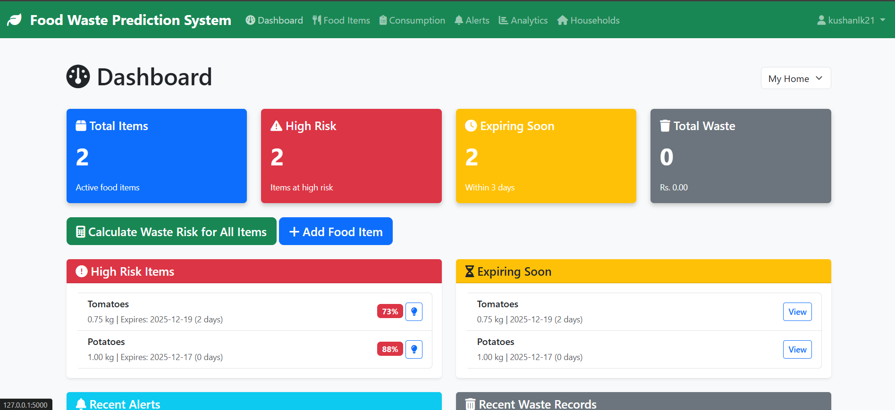
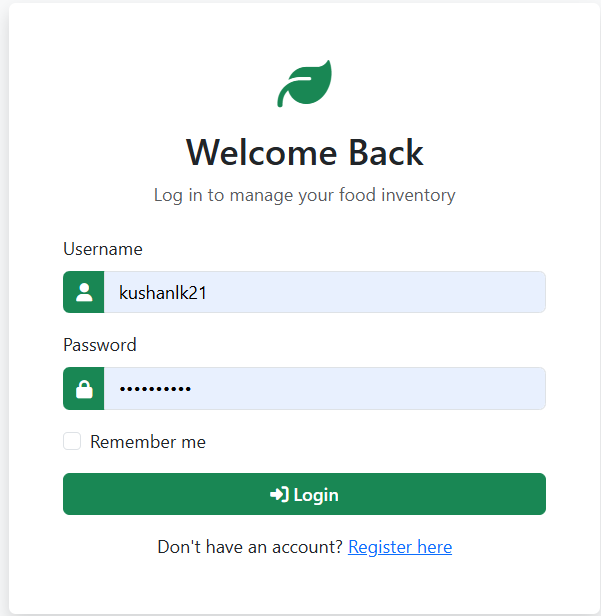
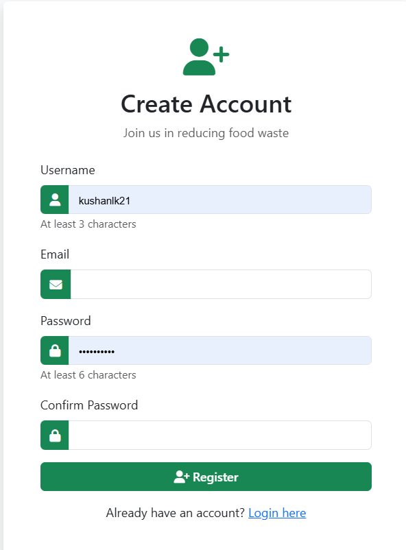
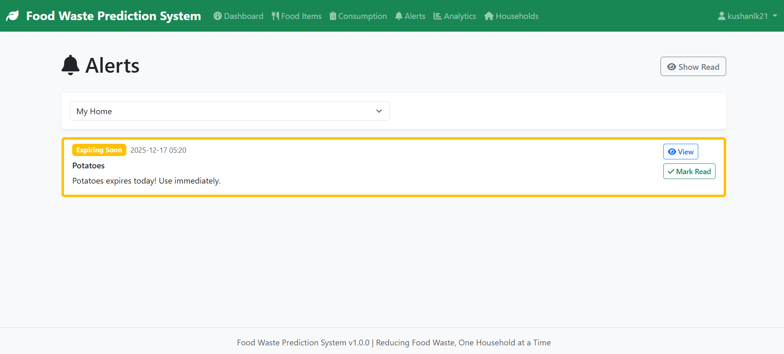
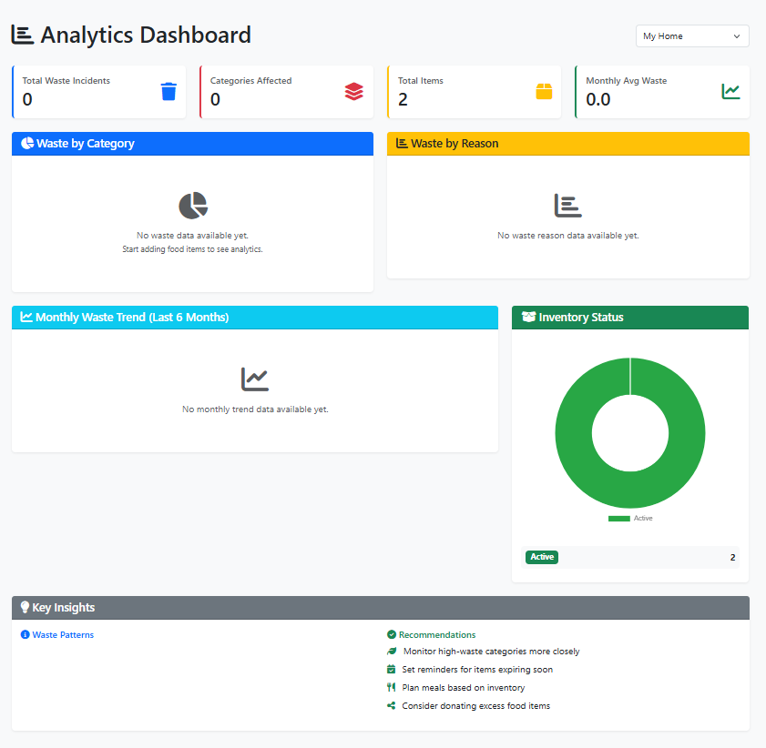
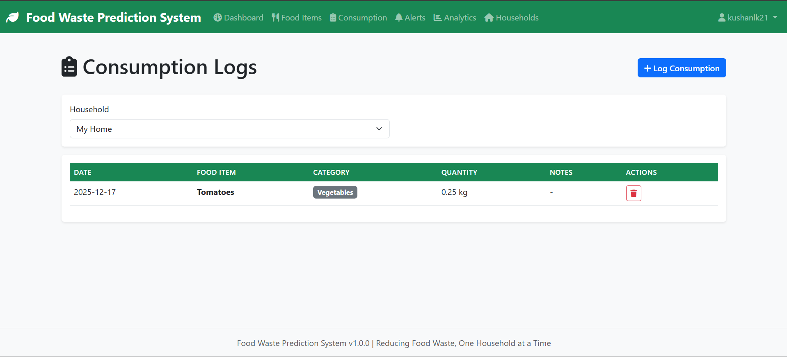
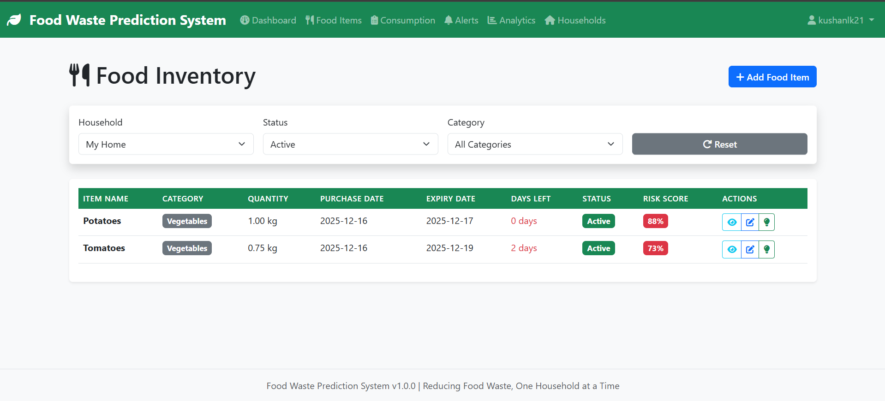
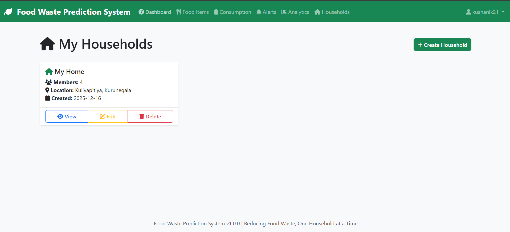
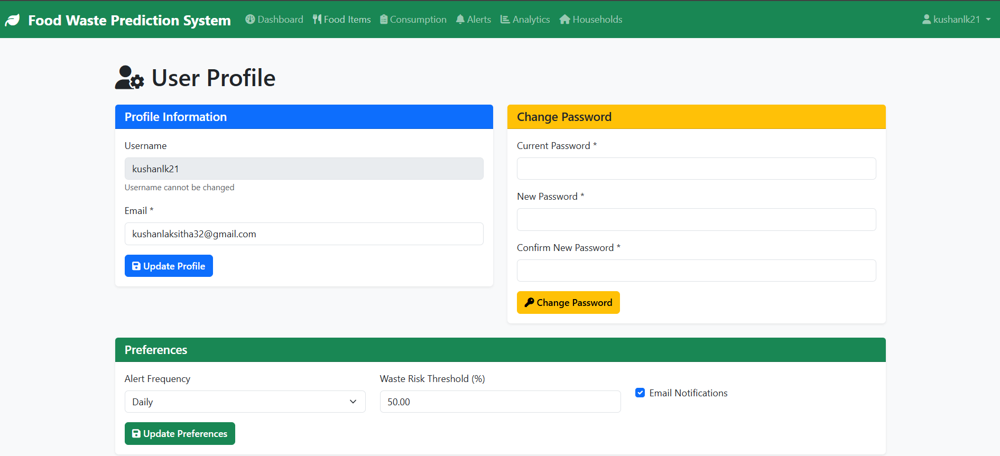

# Food Waste Prediction and Reduction System

A comprehensive web-based application designed to help households minimize food wastage through data-driven analysis and intelligent recommendations.

## Screenshots










## Features

- **User Management**: Secure registration and authentication system
- **Household Management**: Support for multiple households per user
- **Food Inventory**: Track food items with purchase dates, expiry dates, and quantities
- **Consumption Logging**: Record daily food consumption patterns
- **Waste Risk Prediction**: Intelligent algorithm calculates waste risk scores based on:
  - Remaining shelf life
  - Consumption frequency
  - Quantity remaining
  - Food perishability level
- **Automated Alerts**: Proactive notifications for high-risk items
- **Smart Recommendations**: Personalized suggestions for:
  - Prioritizing usage
  - Preservation methods
  - Recipe ideas
  - Donation opportunities
- **Analytics Dashboard**: Visual insights into:
  - Waste trends
  - Category-wise analysis
  - Monthly patterns
  - Overall consumption behavior

## Technology Stack

- **Backend**: Flask (Python web framework)
- **Database**: MySQL with SQLAlchemy ORM
- **Authentication**: Flask-Login
- **Frontend**: Bootstrap 5, HTML5, CSS3
- **Charts**: Chart.js / Plotly
- **Icons**: Font Awesome 6

## Installation

### Prerequisites

- Python 3.8 or higher
- MySQL 8.0 or higher
- pip (Python package manager)

### Step 1: Clone the Repository

```bash
git clone https://github.com/KushanLaksitha/food_waste_prediction_system
cd food_waste_prediction_system
```

### Step 2: Create Virtual Environment

```bash
# Windows
python -m venv venv
venv\Scripts\activate

# Linux/Mac
python3 -m venv venv
source venv/bin/activate
```

### Step 3: Install Dependencies

```bash
pip install -r requirements.txt
```

### Step 4: Database Setup

1. Create MySQL database:
```sql
CREATE DATABASE food_waste_db;
```

2. Import the database schema:
```bash
mysql -u root -p food_waste_db < database.sql
```

3. Update database credentials in `config.py` or set environment variables:
```bash
export MYSQL_USER=your_username
export MYSQL_PASSWORD=your_password
export MYSQL_HOST=localhost
export MYSQL_DB=food_waste_db
```

### Step 5: Run the Application

```bash
python app.py
```

The application will be available at `http://localhost:5000`

## Configuration

### Environment Variables

Create a `.env` file in the root directory:

```env
FLASK_ENV=development
SECRET_KEY=your-secret-key-here
MYSQL_HOST=localhost
MYSQL_PORT=3306
MYSQL_USER=root
MYSQL_PASSWORD=your_password
MYSQL_DB=food_waste_db
```

### Configuration Options

Edit `config.py` to customize:
- Risk thresholds
- Alert frequency
- Session lifetime
- Pagination settings

## Usage Guide

### 1. Registration and Login

- Create an account with username, email, and password
- Log in to access the dashboard

### 2. Create a Household

- Navigate to Households → Create Household
- Enter household name, number of members, and location

### 3. Add Food Items

- Go to Food Items → Add Food Item
- Select household and category
- Enter item details: name, quantity, unit, purchase date, expiry date

### 4. Log Consumption

- Navigate to Consumption → Log Consumption
- Select food item and enter quantity consumed
- Add optional notes

### 5. Calculate Waste Risk

- From the Dashboard, click "Calculate Waste Risk for All Items"
- System analyzes all active items and generates risk scores
- Alerts are automatically created for high-risk items

### 6. View Recommendations

- Click on any food item to view personalized recommendations
- Get suggestions for preservation, recipes, and usage priorities

### 7. Analytics

- Access the Analytics page for visual insights
- View waste trends by category, reason, and time period
- Export data for further analysis

## Waste Risk Calculation

The system uses a weighted algorithm to calculate waste risk:

```
Risk Score = (Shelf Life Risk × 0.40) + 
             (Consumption Risk × 0.30) + 
             (Quantity Risk × 0.20) + 
             (Perishability Risk × 0.10)
```

### Risk Levels

- **Low Risk (0-39%)**: Item is being consumed well
- **Medium Risk (40-69%)**: Item needs attention
- **High Risk (70-100%)**: Immediate action required

## Project Structure

```
food_waste_prediction_system/
│
├── app.py                      # Main application entry point
├── config.py                   # Configuration settings
├── models.py                   # Database models
├── requirements.txt            # Python dependencies
├── database.sql               # Database schema
│
├── routes/                     # Route blueprints
│   ├── auth.py                # Authentication routes
│   ├── household.py           # Household management
│   ├── food.py                # Food inventory management
│   ├── consumption.py         # Consumption logging
│   └── prediction.py          # Risk prediction and analytics
│
├── utils/                      # Utility modules
│   ├── waste_predictor.py     # Waste risk algorithm
│   └── recommender.py         # Recommendation engine
│
├── templates/                  # HTML templates
│   ├── base.html              # Base template
│   ├── dashboard.html         # Main dashboard
│   ├── login.html             # Login page
│   ├── register.html          # Registration page
│   ├── food/                  # Food-related templates
│   ├── household/             # Household templates
│   └── consumption/           # Consumption templates
│
└── static/                     # Static files
    ├── css/
    │   └── style.css          # Custom styles
    ├── js/
    │   └── main.js          # Chart configurations
    └── images/                # Image assets
```

## API Endpoints

### Authentication
- `POST /auth/register` - User registration
- `POST /auth/login` - User login
- `GET /auth/logout` - User logout

### Households
- `GET /household/` - List households
- `POST /household/create` - Create household
- `GET /household/<id>` - View household
- `POST /household/<id>/edit` - Edit household
- `POST /household/<id>/delete` - Delete household

### Food Items
- `GET /food/` - List food items
- `POST /food/add` - Add food item
- `GET /food/<id>` - View food item
- `POST /food/<id>/edit` - Edit food item
- `POST /food/<id>/delete` - Delete food item
- `POST /food/<id>/mark_wasted` - Mark as wasted

### Consumption
- `GET /consumption/` - List consumption logs
- `POST /consumption/log` - Log consumption
- `POST /consumption/<id>/delete` - Delete log

### Prediction & Analytics
- `GET /prediction/dashboard` - Main dashboard
- `GET /prediction/calculate_risk/<household_id>` - Calculate risks
- `GET /prediction/alerts` - List alerts
- `GET /prediction/analytics` - Analytics page
- `GET /prediction/recommendations/<item_id>` - View recommendations

## Contributing

Contributions are welcome! Please follow these guidelines:

1. Fork the repository
2. Create a feature branch
3. Commit your changes
4. Push to the branch
5. Create a Pull Request

## License

This project is developed for educational purposes as part of a final year project.

## Support

For issues and questions:
- Create an issue in the repository
- gmail :- kushanlaksitha32@gmail.com

## Acknowledgments

- Anthropic for AI assistance
- Bootstrap team for the UI framework
- Flask community for the excellent documentation
- Sri Lankan households for inspiring this solution

## Future Enhancements

- Mobile application (iOS/Android)
- Barcode scanning for quick item entry
- Integration with online grocery stores
- Community food sharing platform
- AI-powered recipe suggestions
- Multi-language support
- Voice-activated logging
- Smart refrigerator integration

---

**Version**: 1.0.0  
**Last Updated**: December 2024  
**Status**: Active Development
